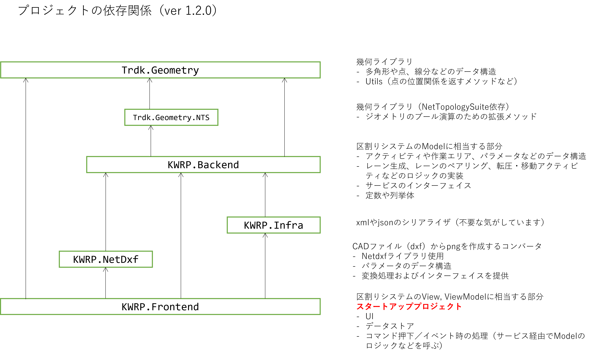

# 区割りシステム

- 区割りシステムです。領域データ（xml, csv）を読込み、VRのアクティビティを生成するUIを提供します
- **.NET 8.0**以上がインストールされたWindows環境で動作します。
- Avalonia MVVMで実装しています

## プロジェクト概要

### 使用ライブラリ

| ライブラリ名                                 | プロジェクト              | 目的                                                                 |
|---------------------------------------------|--------------------------|---------------------------------------------------------------------|
| System.Configuration.ConfigurationManager   | Backend                  | KWRP.configファイルからパラメータ操作のため                           |
| [Avalonia](https://avaloniaui.net/)関係                                | Frontend／NetDxf         | UIフレームワーク                                                     |
| Serilog関係                                 | Frontend                 | ロギング                                                              |
| R3関係                                      | Frontend                 | MVVM用。ReactivePropertyやReactiveCommand、マウス操作実装などに利用     |
| Microsoft.Extensions.DependencyInjection    | Frontend                 | 依存性注入                                                           |
| CommunityToolkit.Mvvm                       | Frontend                 | 未使用（Avalonia Mvvmでプロジェクト作成時に自動的にインストールされたやつ） |
| NetTopologySuite                            | Trdk.Geometry.NTS        | 汎用幾何ライブラリ。ブール演算などに利用                             |
| netDxf                                      | NetDxf                   | dxfファイルの読込みに使用                                           |

## 設定ファイルの概要

### ./KWRP.config

- `DevMode`
  - Releaseビルドかつ`value="true"`のとき開発者モードになります
  - 開発者モードのとき、レーン生成画面でオフセットの値を0未満にしたり、振動ローラの設定値をUI上で変更できます

### ./settings/MachineInfo.json

- 振動ローラの設定値の管理
- 開発者モードの場合、UI上で変更できます

| 変数名 | 説明 |
|--------|------|
| Name | 重機名称 |
| Description | 任意のコメント |
| WheelType | 片鉄輪(0)／両鉄輪(1) |
| LaneWidth | 鉄輪幅 (m) |
| Wheelbase | ホイールベース (m) |
| FrontOverhang | フロントオーバーハング (m) |
| RearOverhang | リアオーバーハング (m) |
| FrontRearMargin | 前後マージン (m) |
| LeftRightMargin | 左右マージン (m) |
| LaneChangeLength | 作業可能長さ (m) |
| LapWidth | ラップ幅 (m) |
| FrontEdgeOffset | 前方端部余裕代 (m) |
| BackEdgeOffset | 後方端部余裕代 (m) |
| WorkAreaLapLength | ラップ調整値 (m) |
| InitialMoveMarginFront | 初期配置用拡幅 作業進捗側 (m) |
| InitialMoveMarginBack | 初期配置用拡幅 作業進捗反対側 (m) |
| RefSpeed | 参照速度 (km/h) |
| EdgeSpeed | 端部速度 (km/h) |
| RepeatNum | 転圧繰返し回数 |

## 更新履歴

- ver 1.2.1
  - 多重起動防止用にmutex導入（ログ、設定ファイルのリリース取合いがこわいので）
  - 開発者モード時に、Single/Tandem切り替えできるよう修正
  - 背景図削除用のボタン追加
  - 初期移動アクティビティの占有エリアの座標を、法肩ラインフォルダに出力するよう変更
- ver 1.2.2
  - アクティビティの点の出力方法を修正
	- ローラが上向きとして、左下の点を基準に時計回り
	- 隣接する頂点の距離が閾値より近い場合は一方の点を削除して出力するように変更
	  - 閾値は`settings/LaneArrangementInfo.json`ファイルの`VertexSimplificationDistanceMeter`から設定
  - 作業エリア編集の属性デフォルト値を修正
	- 後方の整形無しに変更
